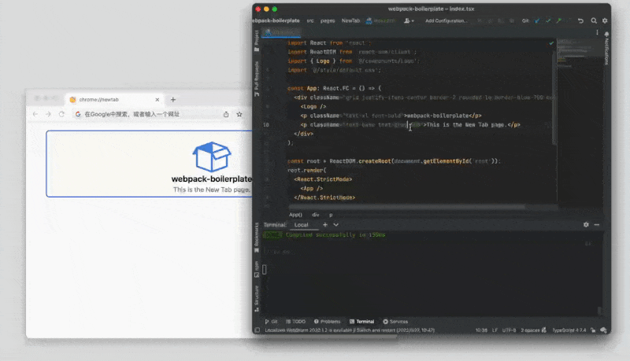
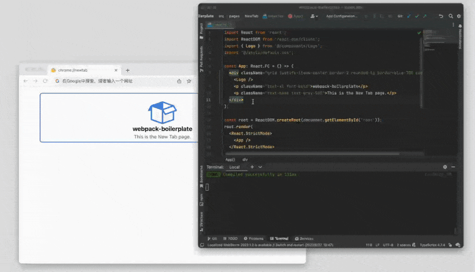
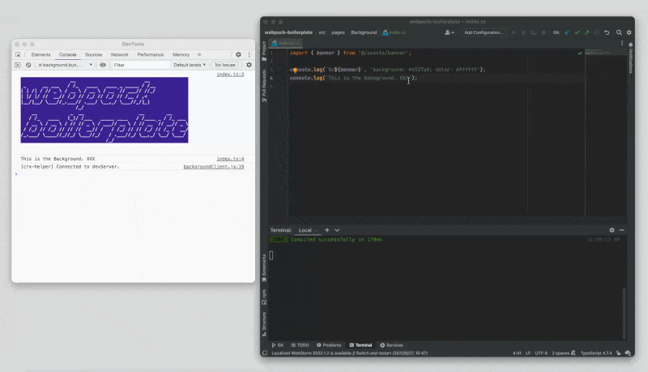
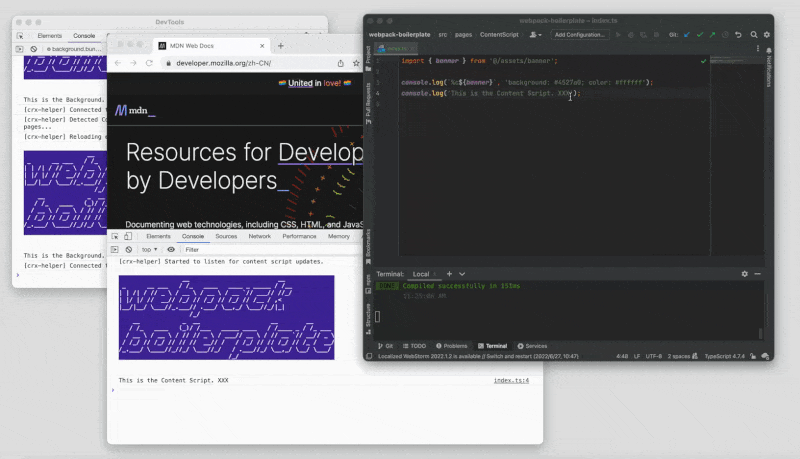

# Webpack Boilerplate

A good starting point for using [webpack](https://webpack.js.org/) to build stuffs.

## Compatibility

Tested on both _Windows_ and _macOS_, with:

- `Node` = `16.15.1`
- `Yarn` = `1.22.19`

## Screenshots

- [Hot Module Replacement (HMR)](https://webpack.js.org/concepts/hot-module-replacement/) Support



- Error Overlay and Friendly Error Display



- _Auto-Reload_ for _Background_ in Chrome extension development



- _Auto-Reload_ for _Content Scripts_ in Chrome extension development



## Features

- Fully customizable webpack-based building system.
- Support webpack 5, React 18, TypeScript, Sass, Less, Tailwind CSS, etc.
- Support [Hot Module Replacement (HMR)](https://webpack.js.org/concepts/hot-module-replacement/).
- Support _Auto Reload_ for _Background_ and _Content Script_ in Chrome extension development.
- Support manifest V3 in Chrome extension development.
- Support [ESLint](https://www.npmjs.com/package/eslint), [stylelint](https://www.npmjs.com/package/stylelint), and [Prettier](https://www.npmjs.com/package/prettier).
- Support [husky](https://www.npmjs.com/package/husky), [lint-staged](https://www.npmjs.com/package/lint-staged), and [commitlint](https://www.npmjs.com/package/@commitlint/cli).

## How to Use

### Update Configurations

- Edit `webpack.config.js` and update the configuration field `entry` to determine what to be built;
- Edit `utils/env.js` and update the configuration field `NOT_HOT_RELOAD` to determine which entries to be excluded from [Hot Module Replacement (HMR)](https://webpack.js.org/concepts/hot-module-replacement/);
- If you are working with Chrome extensions, also:
  - Update configuration field `CONTENT_SCRIPT` and `BACKGROUND` to match the entries of _Content Scripts_ and _Background_ respectively.

### CLI Commands

```bash
# Install dependencies
yarn install

# Start dev server
yarn run start

# Build the application
yarn run build
```

## Notes

### About Hot Module Replacement (HMR)

To use [Hot Module Replacement](https://webpack.js.org/concepts/hot-module-replacement/), please place components outside of the top-level file. Components in the top-level file will be downgraded to _live reload_.

#### Known Issue

When `devMiddleware.writeToDisk` option of `webpack-dev-server` is enabled, [Hot Module Replacement](https://webpack.js.org/concepts/hot-module-replacement/) will not work properly and will downgrade to _live reload_. However, in Chrome extension development, the `devMiddleware.writeToDisk` option is required for Chrome to properly load the extension. It means that [Hot Module Replacement](https://webpack.js.org/concepts/hot-module-replacement/) will barely work.

### About _Auto-Reload_

Remember to keep the DevTool panel of the _Background_ service worker open during development, otherwise _Auto-Reload_ may not work as expected.

See [here](docs/auto-reload.md) for more details.

## Credits

- [tjx666/awesome-chrome-extension-boilerplate](https://github.com/tjx666/awesome-chrome-extension-boilerplate)
- [lxieyang/chrome-extension-boilerplate-react](https://github.com/lxieyang/chrome-extension-boilerplate-react)
- <div>Icons made by <a href="https://www.flaticon.com/authors/freepik" title="Freepik">Freepik</a> from <a href="https://www.flaticon.com/" title="Flaticon">www.flaticon.com</a></div>
